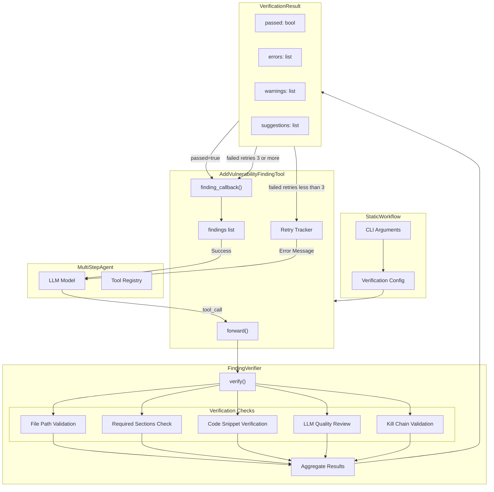
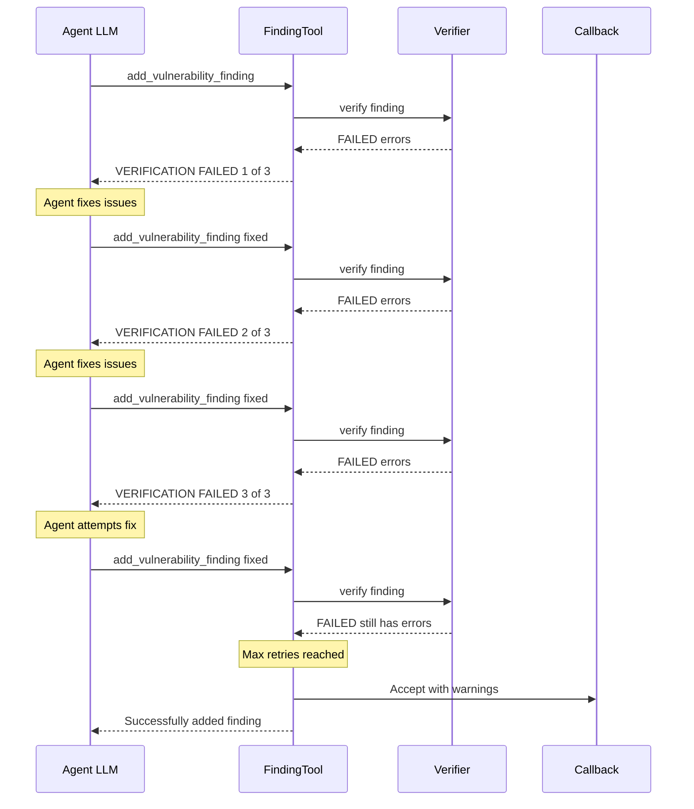
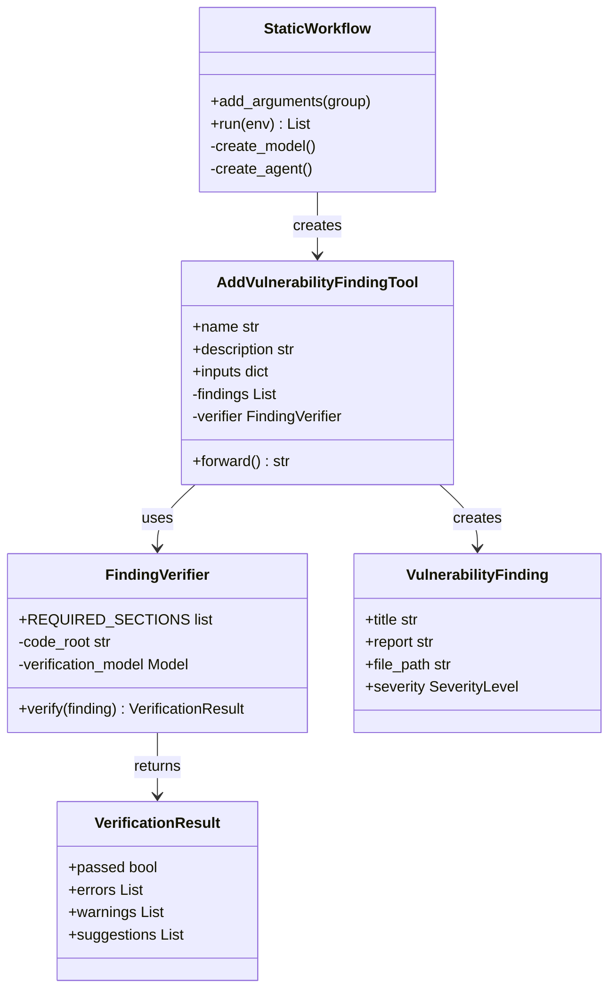

# Finding Verifier Architecture

## Overview

The Finding Verifier validates vulnerability findings before submission, ensuring quality and accuracy with up to 3 retry cycles for corrections.

## Architecture Diagram

## Retry Cycle Flow

## Component Relationships

## Configuration Options

| Option | Default | Description |
|--------|---------|-------------|
| `--enable-verification` | `true` | Enable finding verification |
| `--disable-verification` | - | Disable verification |
| `--enable-kill-chain` | `false` | Execute exploit code to validate |
| `--max-verification-retries` | `3` | Max retry attempts |
| `--verification-model` | `gpt-5-nano` | Model for LLM review |

## Verification Checks Summary

| Check | Purpose | On Failure |
|-------|---------|------------|
| **File Path** | Verify file exists in codebase | Error + similar file suggestions |
| **Required Sections** | Ensure all 6 sections present | Error listing missing sections |
| **Code Snippets** | Match code blocks to source | Warning or error |
| **LLM Review** | Quality and accuracy check | Errors + suggestions |
| **Kill Chain** | Execute exploit code | Error if execution fails |

## Required Report Sections

1. **Overview** - Brief description of the vulnerability
2. **Where it occurs** - File path, function, line number
3. **Vulnerability Details** - Technical explanation
4. **Impact** - Business/security impact
5. **Steps to Reproduce** - Exploit instructions
6. **Remediation** - How to fix
